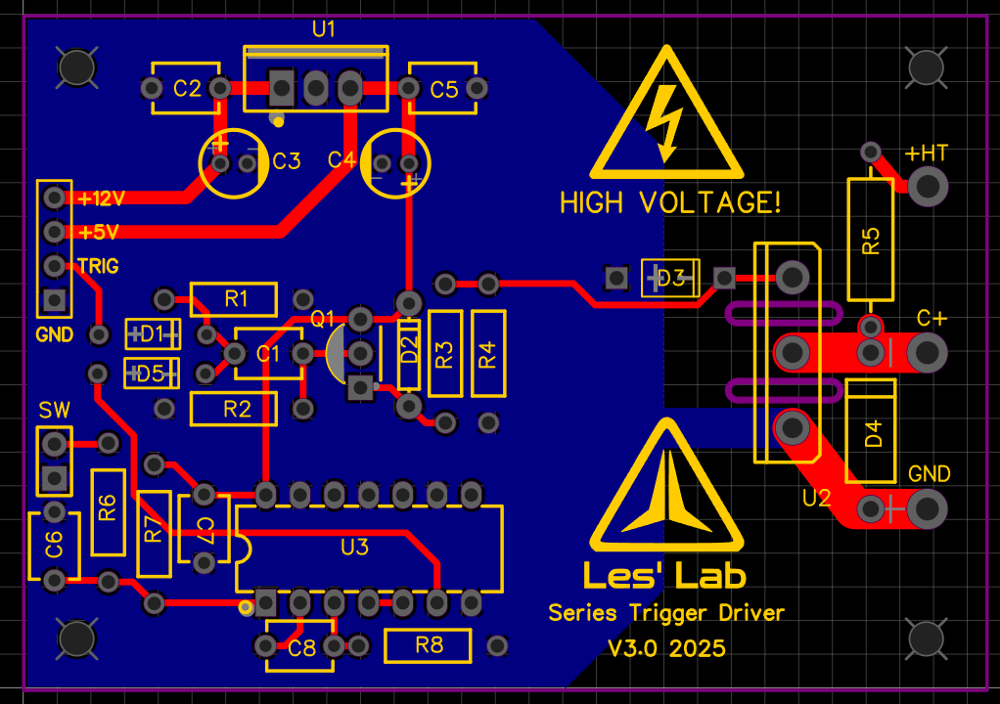

# Series-Trigger

Series trigger board for triggering flashlamps, of whatever else you need a high voltage trigger for!!!

This is a trigger PCB for xenon flashlamps.

It was designed for a YAG laser featured in:  https://youtu.be/C_Ci-ufpkdM

The trigger transformer in the video was wound on a LOPT core, with a 30 turn seconday and a 2 turn primary.
The capacitor was 0.022uF, not overly large, and will reliably trigger small YAG laser xenon flash lamps.

It is a simple trigger, and there is no reason why is can't be used to trigger any trigger transformer, just consult the datasheet for wehatever transformer you are using!

